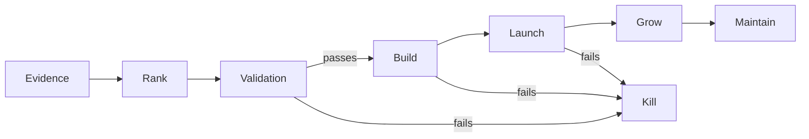

# Opportunity Portfolio

> Last updated: **2026-10-06**

This is the current ranked view of the opportunity portfolio. Ranking is **ordinal and evidence-driven**, not an arbitrary score.

## 🏆 Current recommendation

### #1 — [GST Exception Resolver](ideas/gst-exception-resolver.md)

**Stage:** VALIDATING  
**Thesis:** Help CA firms resolve GST reconciliation exceptions instead of merely detecting mismatches.  
**Why now:** recurring manual reconciliation + identifiable B2B payer + AI can explain exceptions while deterministic code preserves financial correctness.  
**Next action:** obtain real anonymized reconciliation files from 3 CA firms and measure whether the prototype saves meaningful time.

---

## Ranked portfolio

| Rank | Move | Opportunity | Stage | One-line thesis | Evidence | Effort | Monetization | Next validation |
|---:|:---:|---|---|---|---|---|---|---|
| 🥇 1 | 🆕 | [GST Exception Resolver](ideas/gst-exception-resolver.md) | VALIDATING | Resolve GST mismatches and explain the action required. | Strong emerging practitioner evidence | Medium | B2B subscription | 3 CA firms + real anonymized files |
| 🥈 2 | 🆕 | [Agent Permission Diff](ideas/agent-permission-diff.md) | VALIDATING | Git diff for AI-agent permissions and capability changes. | Strong technical/security evidence | Medium | Developer SaaS | GitHub Action prototype |
| 🥉 3 | 🆕 | [WhatsApp Stalled Deal Detector](ideas/whatsapp-stalled-deal-detector.md) | VALIDATING | Find WhatsApp conversations where revenue is likely being lost. | Medium/strong workflow evidence | Medium | B2B SaaS | Validate workflow without deep API investment |

## Why this ranking?

**#1 GST** currently has the clearest evidence-to-effort path: narrow customer, recurring workflow, measurable time savings, and a spreadsheet-first MVP.

**#2 Agent Permission Diff** has stronger global upside and excellent technical fit, but the generic agent-security category is becoming crowded. The wedge must remain narrow.

**#3 WhatsApp Stalled Deal Detector** has clear pain and an identifiable ROI, but WhatsApp automation is competitive and platform/API constraints make the wedge riskier.

---

## Pipeline

| Stage | Current opportunities |
|---|---|
| VALIDATING | GST Exception Resolver, Agent Permission Diff, WhatsApp Stalled Deal Detector |
| BUILD | — |
| LAUNCH | — |
| GROW | — |
| MAINTAIN | — |
| KILL | — |

## Recent movement

This is the initial portfolio snapshot. Future runs must record meaningful rank/status changes rather than rewriting history.

## Decision rule

Do not build #1 automatically.

The next decision is determined by the **fastest credible validation experiment**.

## Visual model

