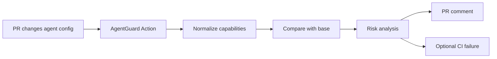
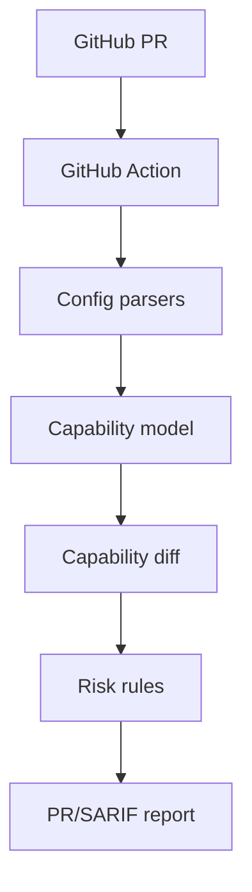

# Agent Permission Diff

> **A Git diff for AI-agent capabilities: show developers exactly what permissions an agent gains or loses when agent/MCP configuration changes.**

## Status

- Rank: **#2**
- Movement: 🔻 Major downgrade — direct substitutes found
- Stage: **VALIDATING**
- First discovered: 2026-10-06
- Last validated: Not yet validated with developers
- Last updated: 2026-10-07
- Recommended action: **Do not build the generic wedge; revisit only if a differentiated niche emerges**

## TL;DR

AI agents increasingly interact with files, terminals, GitHub, browsers, databases, messaging systems and other tools.

The security question is changing from:

> "Does this agent have GitHub access?"

to:

> "What exact capabilities changed in this PR?"

The proposed wedge is not a generic AI security platform.

It is:

> **Permission/capability diff for agent configuration in GitHub PRs.**

## Problem

An agent configuration change can expand capability without making the risk obvious in ordinary code review.

Example:

```text
Before:
filesystem → ./src

After:
filesystem → /

New exposure:
~/.ssh
~/.aws
.env
other repositories
```

The developer needs a concise explanation of the new capability.

## Exact user

- AI-agent developers
- platform engineers
- security-conscious developers
- teams using MCP
- teams using coding/browser agents.

## Payer

Initially:

- individual developers;
- small engineering teams.

Later:

- security/platform teams.

## Current workaround

- manually review config;
- inspect MCP server definitions;
- rely on broad tool permissions;
- use existing security scanners;
- rely on agent-specific approval mechanisms.

## Proposed workflow



## Evidence

### Observed

Current MCP/agent security research and issue discussions show recurring concerns around:

- excessive filesystem access;
- unconstrained GitHub operations;
- prompt injection;
- tool/server-controlled instructions;
- browser capabilities;
- permission boundaries.

There are now direct implementations of the exact concept: Agent Permission Diff Bot provides PR-native permission diffs and a GitHub Action; agent-permission-diff provides CI/SARIF; agent-scope-diff explicitly positions itself as a git diff for agent access. Snyk Agent Scan also covers MCP/agent/skill security.

### Inference

The market is real, but the generic "agent security scanner" category is increasingly crowded.

### Hypothesis

The PR-native experience is sensible, but the market now contains multiple open implementations. A solo entrant would need a stronger moat such as runtime-vs-declared permission drift or a specific enterprise/compliance workflow.

## Competition

The broader category includes MCP scanners, configuration linters, runtime gateways and enterprise agent governance platforms.

Our wedge must remain:

> **"Git diff for agent permissions."**

Not:

> "Complete AI security platform."

## Why now?

Agent adoption is expanding faster than many organizations' ability to reason about action-level permissions.

## MVP

### Must have

- GitHub Action;
- parse selected agent/MCP configuration;
- normalize capabilities;
- compare base/head;
- risk categories;
- PR comment.

### Should have

- configurable rules;
- SARIF output;
- policy file.

### Not now

- runtime proxy;
- enterprise dashboard;
- credential vault;
- full SIEM;
- AI firewall.

## Architecture



## Build plan

1. Define capability schema.
2. Support a small number of agent/MCP config formats.
3. Implement deterministic capability extraction.
4. Implement base/head diff.
5. Add 20–30 high-confidence rules.
6. Build PR comment.
7. Test against deliberately vulnerable fixtures.

## AI-agent tasks

- research/config fixture generation;
- parser implementation;
- rule-engine implementation;
- test fixture generation;
- GitHub Action packaging;
- documentation.

Do not delegate security decisions blindly; every rule needs an explicit rationale and test.

## Distribution

- GitHub Marketplace;
- open-source GitHub Action;
- developer communities;
- MCP communities;
- security/devtool content;
- examples demonstrating dangerous permission diffs.

## Monetization

Possible:

- free open-source scanner;
- paid private repository/team policies;
- organization dashboards;
- historical audit;
- custom policy packs.

Initial pricing is a hypothesis.

## Validation

Build a tiny GitHub Action.

Get 10 developers who use agents/MCP.

Ask them to install it on a non-sensitive repository.

Measure:

- whether it finds meaningful changes;
- whether developers understand the output;
- whether they would keep it;
- whether they would pay for private/team capabilities.

## Success criteria

Promising if developers voluntarily keep the Action installed and request additional rules/integrations.

## Failure criteria

- users see little value beyond existing linters/scanners;
- capability extraction is too unreliable;
- configuration formats fragment excessively;
- developers do not care about permission drift.

## Kill conditions

Kill this exact wedge if developers prefer existing scanners and the PR-native experience does not create differentiated value.

## Risks

- rapidly changing agent formats;
- false positives;
- security credibility;
- crowded ecosystem;
- difficult normalization;
- evolving MCP specifications.

## Open questions

1. Which agent config format should be supported first?
2. Is MCP the right first ecosystem?
3. Will GitHub Marketplace distribution be sufficient?
4. What is the minimum rule set developers consider useful?
5. Can capability normalization become a durable moat?

## Ranking history

| Date | Rank | Stage | Movement | Reason |
|---|---:|---|---|---|
| 2026-10-06 | 2 | VALIDATING | 🆕 | Strong market signal, but generic category is crowded. |
| 2026-10-07 | 3 | VALIDATING | 🔻 | Exact wedge now has multiple direct open-source implementations; no differentiated demand is proven. |

## Decision history

2026-10-06 — Narrowed from generic AgentGuard to Agent Permission Diff.
