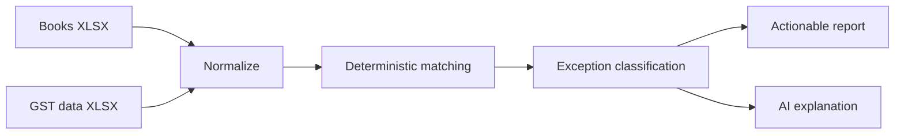
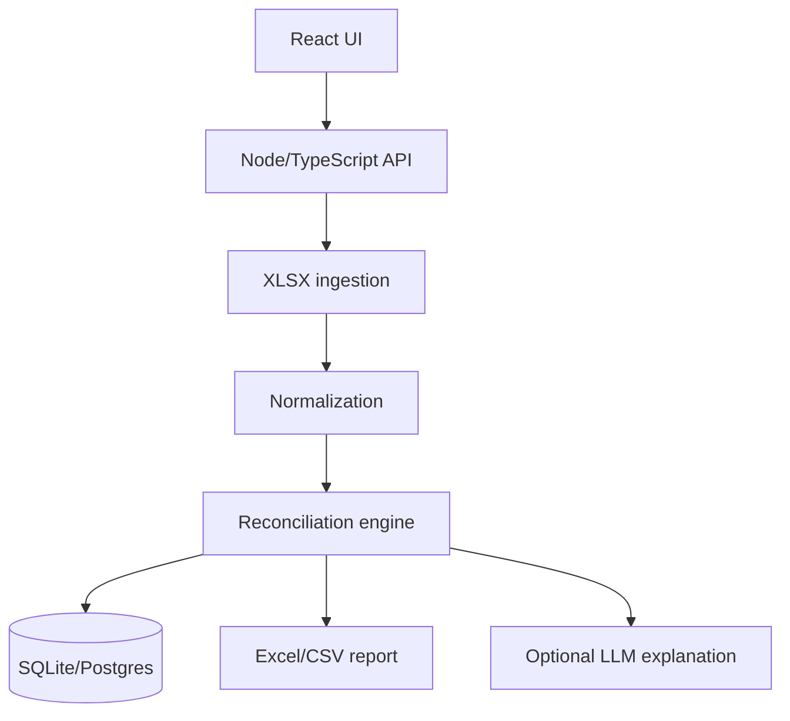

# GST Exception Resolver

> **Help CA firms resolve GST reconciliation exceptions and explain the action required, rather than merely showing mismatched rows.**

## Status

- Rank: **#1**
- Movement: 🆕 Initial ranking
- Stage: **VALIDATING**
- First discovered: 2026-10-06
- Last validated: Not yet validated with customer data
- Last updated: 2026-10-06
- Recommended action: **Test with 3 CA firms using anonymized real reconciliation files**

## TL;DR

Indian CA/accounting teams repeatedly reconcile books against GST data. The painful part is often not finding a mismatch; it is determining **why** it happened and **what to do next**.

The proposed wedge is deliberately narrow:

> Upload two spreadsheet exports → reconcile deterministically → classify exceptions → explain likely cause → produce an actionable report.

The MVP should not start with GSTN API integration or a full accounting platform.

## Problem

Typical exception categories include:

- invoice missing on one side;
- GSTIN mismatch;
- invoice-number formatting mismatch;
- tax/value mismatch;
- duplicate;
- timing/filing-period difference;
- credit-note/amendment difference.

The workflow is repetitive and spreadsheet-heavy.

## Exact user

Primary:

- CA firms
- GST practitioners
- outsourced bookkeeping/accounting teams

Secondary:

- finance teams managing large vendor populations.

## Payer

The CA/accounting firm or finance department.

## Current workaround

Likely combination of:

- accounting software;
- GST portal exports;
- Excel;
- lookup formulas;
- manual inspection;
- client/vendor follow-up.

## Proposed solution

## Evidence

### Observed

Current research found Indian practitioner discussions describing invoice-level GST reconciliation as a recurring workload, including discussions from CA professionals managing many clients.

Industry products such as ClearTax also document multiple reconciliation mismatch categories, demonstrating that this is a real and recurring workflow.

### Inference

A narrow "exception resolver" may be more differentiated than another generic GST/accounting platform.

### Hypothesis

CA firms will pay monthly if the product reliably reduces staff hours without introducing financial/compliance errors.

## Competitors

| Competitor/category | Strength | Weakness/opportunity |
|---|---|---|
| ClearTax | Broad tax/accounting ecosystem | Opportunity is to focus narrowly on exception explanation/action |
| Tally ecosystem | Deep accounting adoption | Not necessarily optimized around a lightweight exception-resolution workflow |
| GST reconciliation tools | Existing reconciliation functionality | Need evidence that users still need a better exception workflow |

Competitor research must be refreshed before launch.

## Why now?

AI makes it practical to add a useful **explanation layer** to deterministic reconciliation.

The product can say:

> "These records match on supplier and value but fall into different filing periods; verify whether this is a timing difference."

The model should never decide the underlying financial match.

## MVP

### Must have

- XLSX upload;
- schema mapping;
- normalization;
- deterministic matching;
- exception classification;
- downloadable exception report;
- basic dashboard.

### Should have

- AI explanation;
- suggested next action;
- reusable mapping templates.

### Not now

- GSTN integration;
- accounting-system integrations;
- automated filing;
- automated client communication;
- enterprise permissions;
- complex dashboards.

## Architecture

**Critical design rule:** deterministic code owns financial truth. AI only explains already-detected exceptions.

## Build plan

### Day 1

- XLSX parser
- normalized internal model
- matching engine
- fixtures/tests

### Day 2

- exception classifications
- basic API
- report generation
- simple UI

### Day 3

- AI explanation
- end-to-end workflow
- validation with CA users

## AI-agent tasks

1. Build XLSX ingestion with tests.
2. Build normalization layer.
3. Implement deterministic matcher.
4. Generate synthetic edge-case fixtures.
5. Implement exception classifier.
6. Build report generator.
7. Build React UI.
8. Add optional LLM explanation behind a provider interface.
9. Add end-to-end tests.

Each agent task should have explicit acceptance criteria and must not silently change financial matching rules.

## Distribution

Initial:

- direct outreach to CA firms;
- local professional network;
- CA communities;
- accounting/GST communities;
- targeted demos using anonymized/synthetic examples.

Later:

- SEO around specific reconciliation problems;
- CA partnerships;
- accounting consultants;
- referral program.

## Monetization

Initial hypotheses:

- one-off reconciliation;
- small monthly plan;
- multi-client CA-firm plan.

Potential starting experiments may test roughly ₹500–₹5,000/month depending on client volume and value.

These are **pricing hypotheses, not market facts**.

## Validation experiment

Recruit 3 CA firms.

Ask for anonymized exports.

Measure:

- processing time;
- exception accuracy;
- useful/incorrect explanations;
- hours saved;
- willingness to continue;
- willingness to pay.

## Success criteria

Promising if:

- at least 2/3 firms use real data;
- the tool identifies useful exceptions;
- users report meaningful time savings;
- at least one wants continued use;
- at least one gives a credible paid commitment.

## Failure criteria

- existing software already solves the exact workflow;
- users do not trust automated reconciliation;
- input formats are too chaotic;
- exception accuracy is poor;
- time saved is insignificant.

## Kill conditions

Kill this wedge if repeated real-data trials show no meaningful improvement over current tools/workflows.

## Risks

- financial correctness;
- tax/compliance interpretation;
- messy input formats;
- liability expectations;
- competitor bundling;
- GST portal/API changes.

## Open questions

1. What exact files do target CA firms use?
2. Which mismatch category consumes the most time?
3. How much manual review remains after deterministic matching?
4. Will firms upload client data to a third-party SaaS?
5. What price corresponds to meaningful ROI?
6. Is an Excel-first product enough?

## Evidence log

| Date | Evidence | Interpretation |
|---|---|---|
| 2026-10-06 | Practitioner discussions describe recurring GST reconciliation work. | Strong problem signal; needs direct validation. |
| 2026-10-06 | Existing tax products document multiple reconciliation mismatch categories. | Confirms established workflow, but not necessarily unmet demand. |

## Ranking history

| Date | Rank | Stage | Movement | Reason |
|---|---:|---|---|---|
| 2026-10-06 | 1 | VALIDATING | 🆕 | Best current evidence-to-effort path. |

## Decision history

2026-10-06 — Selected for the first validation experiment. No build commitment beyond a small prototype.
