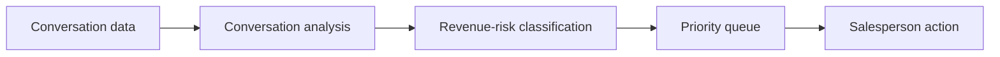

# WhatsApp Stalled Deal Detector

> **Identify WhatsApp conversations where a lead is likely being lost because the conversation has stalled.**

## Status

- Rank: **#3**
- Movement: 🆕 Initial ranking
- Stage: **VALIDATING**
- First discovered: 2026-10-06
- Last validated: Not yet validated with target businesses
- Last updated: 2026-10-06
- Recommended action: **Validate the insight/report workflow before deep WhatsApp integration**

## TL;DR

Many Indian SMB sales workflows live inside WhatsApp.

The problem is not necessarily lack of messaging automation.

It is:

> Which conversations are currently costing me money?

The proposed product analyzes conversation state and highlights likely revenue leakage:

- quote sent, no response;
- customer asked a question, no response;
- salesperson promised follow-up, forgot;
- high-value lead has gone quiet;
- customer is waiting for an action.

## Problem

Sales teams can have hundreds of WhatsApp conversations but poor visibility into which ones need attention.

## Exact user

- small sales teams;
- real-estate teams;
- education/coaching businesses;
- service businesses;
- high-ticket SMB sellers.

## Payer

Business owner or sales manager.

## Current workaround

- manually scroll WhatsApp;
- spreadsheets;
- generic CRM;
- salesperson memory;
- WhatsApp Business labels;
- existing automation tools.

## Proposed workflow



Example:

> **HIGH PRIORITY:** ₹2.4L quote sent 11 days ago. Customer said they would discuss internally. Recommended follow-up today.

## Evidence

### Observed

Recent Indian SMB discussions describe employees manually reviewing WhatsApp conversations to identify missed leads/follow-ups.

Existing vendors already sell WhatsApp lead/follow-up automation to Indian sales teams.

### Inference

The category has proven demand, but generic WhatsApp CRM is not attractive for a new solo entrant.

### Hypothesis

A narrow "revenue leakage detector" can differentiate by focusing on prioritization rather than messaging automation.

## Competitors

Existing WhatsApp CRM/automation platforms have:

- established integrations;
- messaging automation;
- CRM features;
- sales workflows.

Our possible wedge:

> **Find the conversations that matter most.**

## Why now?

WhatsApp remains a major business communication channel in India, while increasing message volume makes manual prioritization harder.

## MVP

### Must have

- conversation import or manually uploaded sample data;
- conversation-state classifier;
- priority queue;
- reason for priority;
- basic ROI/value field.

### Should have

- configurable vertical rules;
- CRM export;
- reminders.

### Not now

- autonomous message sending;
- mass messaging;
- deep WhatsApp API platform;
- full CRM.

## Validation-first architecture

Do **not** begin with deep WhatsApp integration.

Start with:

```text
CSV/JSON conversation export
        ↓
Conversation classifier
        ↓
Stalled-deal detector
        ↓
Priority report
```

If users value the output, then solve integration.

## AI-agent tasks

- generate synthetic conversations;
- classify conversation states;
- build deterministic/LLM hybrid detector;
- build evaluation set;
- create dashboard;
- research compliant integration routes.

## Distribution

- direct outreach to SMB sales managers;
- real-estate communities;
- coaching/education businesses;
- WhatsApp sales consultants;
- existing CRM/agency partners.

## Monetization

Possible:

- ₹999–₹4,999/month depending on seats/conversation volume;
- agency plans;
- vertical-specific packages.

These are hypotheses only.

## Validation experiment

Give 5 sales managers a manually generated or uploaded conversation report.

Ask:

1. Which flagged conversations are actually valuable?
2. Did we find something their current workflow missed?
3. How much money/time could this save?
4. Would they check it daily?
5. Would they pay?

## Success criteria

At least 3/5 users identify meaningful missed opportunities and at least one expresses a credible paid commitment.

## Failure criteria

- users already have adequate prioritization;
- classification accuracy is poor;
- value is difficult to measure;
- API restrictions make the workflow impractical.

## Kill conditions

Kill the idea if the product requires becoming a full WhatsApp CRM to provide value.

## Risks

- WhatsApp/Meta API restrictions;
- privacy/data handling;
- competitive incumbents;
- messaging policy;
- false positives;
- integration complexity.

## Open questions

1. Which vertical has the highest revenue per missed conversation?
2. Can conversation priority be inferred reliably?
3. Can we validate without privileged WhatsApp access?
4. Is the real buyer the owner, sales manager, or agency?
5. Does a daily report create enough value to pay?

## Ranking history

| Date | Rank | Stage | Movement | Reason |
|---|---:|---|---|---|
| 2026-10-06 | 3 | VALIDATING | 🆕 | Strong workflow pain but higher platform/competition risk. |

## Decision history

2026-10-06 — Narrowed from generic WhatsApp CRM to revenue-leakage detection.
