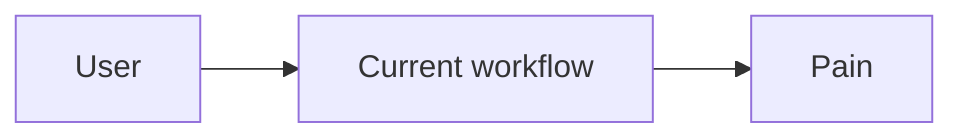
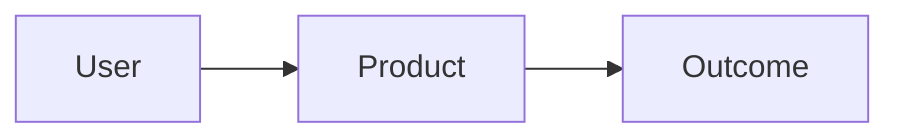

# {{Opportunity Name}}

> {{One-sentence thesis}}

## Status

- Rank:
- Movement:
- Stage:
- First discovered:
- Last validated:
- Last updated:
- Recommended action:

## TL;DR

## Problem

## Exact user

## Payer

## Current workaround

## Proposed solution

## Current workflow

## Proposed workflow

## Evidence

### Observed

### Inference

### Hypothesis

## Competitors

| Competitor | Strength | Weakness | Opportunity for us |
|---|---|---|---|

## Why now?

## MVP

### Must have

### Should have

### Not now

## Architecture

## Build plan

## AI-agent tasks

## Distribution

## Monetization

## Unit economics

## Validation experiment

## Success criteria

## Failure criteria

## Kill conditions

## Risks

## Open questions

## Evidence log

| Date | Evidence | Source | Interpretation |
|---|---|---|---|

## Ranking history

| Date | Rank | Stage | Movement | Reason |
|---|---:|---|---|---|

## Decision history
